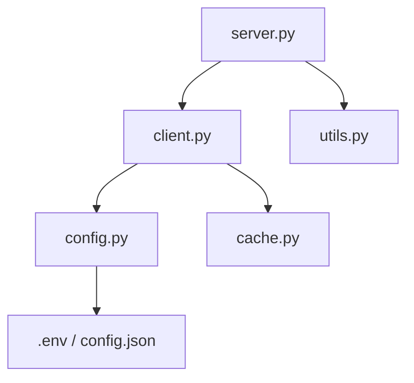

# Scopus MCP Project Structure Documentation

This document provides a detailed overview of the Scopus Model Context Protocol (MCP) server project.

## 1. Directory Structure

```
ScopusMCP/
├── config.json                 # Configuration file (API keys)
├── claude_desktop_config.json  # Configuration for Claude Desktop integration
├── pyproject.toml              # Project metadata and dependencies (PEP 621)
├── README.md                   # General project overview and setup instructions
├── .env                        # Environment variables (optional, not committed)
├── src/
│   └── scopus_mcp/             # Main source package
│       ├── __init__.py         # Package marker
│       ├── cache.py            # Caching mechanism implementation
│       ├── client.py           # Async HTTP client for Scopus API
│       ├── config.py           # Configuration loading logic
│       ├── server.py           # MCP server entry point and tool definitions
│       └── utils.py            # Data cleaning and helper functions
├── tests/                      # Test suite
│   ├── test_client.py          # Unit tests for API client
│   ├── test_parser.py          # Unit tests for data parsing
│   └── verify_refactor.py      # Verification script for refactoring
└── logs/                       # (Optional) Log directory
```

## 2. Module Descriptions

### Core Modules (`src/scopus_mcp/`)

*   **`server.py`**: The heart of the MCP server.
    *   **Purpose**: Initializes the MCP server instance, defines available tools (`search_scopus`, `get_abstract_details`, `get_author_profile`), and handles incoming JSON-RPC requests from the client (e.g., Claude).
    *   **Key Functions**: `handle_list_tools`, `handle_call_tool`, `main`, `start`.
    *   **Dependencies**: `client`, `utils`, `mcp`.

*   **`client.py`**: High-performance Async HTTP Client.
    *   **Purpose**: Manages communication with the Elsevier Scopus API.
    *   **Key Features**:
        *   **Asynchronous I/O**: Uses `httpx` for non-blocking network calls.
        *   **Rate Limiting**: Automatically handles `429` responses with exponential backoff.
        *   **Caching**: Integrates with `CacheManager` to minimize API quota usage.
        *   **Retries**: Implements retry logic for transient network errors.
    *   **Dependencies**: `config`, `cache`, `httpx`.

*   **`cache.py`**: Caching Layer.
    *   **Purpose**: Persists API responses to disk to speed up repeated queries.
    *   **Implementation**: Uses SHA-256 hashing of URLs and parameters to generate unique filenames. Entries expire after 24 hours (default).
    *   **Dependencies**: `pathlib`, `hashlib`, `json`.

*   **`utils.py`**: Data Transformation.
    *   **Purpose**: Cleans and normalizes raw JSON responses from Scopus into human-readable formats optimized for LLM consumption.
    *   **Key Functions**: `clean_search_results`, `clean_abstract_details`.

*   **`config.py`**: Configuration Management.
    *   **Purpose**: Centralizes access to configuration settings (primarily the API Key).
    *   **Precedence**: Environment Variables (`SCOPUS_API_KEY`) > `config.json` > Error.
    *   **Dependencies**: `python-dotenv`, `pathlib`.

## 3. Dependency Graph



## 4. Execution Flow

1.  **Initialization**:
    *   The MCP client (e.g., Claude Desktop) executes the command specified in `claude_desktop_config.json`: `uv run python -m scopus_mcp.server`.
    *   `server.py`'s `main()` coroutine starts the MCP server over standard input/output (stdio).

2.  **Tool Call**:
    *   **User**: Asks "Find papers on AI".
    *   **Claude**: Sends a `call_tool` request (`search_scopus`) to the server.
    *   **Server**: Receives the request in `handle_call_tool`.
    *   **Client**: `ScopusClient.search_scopus` is awaited.
        *   Checks `CacheManager`.
        *   If miss, sends async HTTP request via `httpx`.
        *   Handles rate limits/retries.
        *   Returns raw JSON.
    *   **Utils**: `clean_search_results` processes the raw JSON.
    *   **Server**: Returns the cleaned text result to Claude.

## 5. Environment Requirements

*   **Python**: Version 3.10 or higher.
*   **Package Manager**: `uv` (recommended) or `pip`.
*   **API Key**: A valid Elsevier Scopus API Key.

## 6. Version Control

*   **Version**: 0.1.0
*   **Git Ignore**: Ensure `.env`, `config.json` (if it contains secrets), `.cache/`, and `__pycache__/` are added to `.gitignore`.

## 7. Best Practices Implemented

*   **Asynchronous I/O**: Switched from `requests` to `httpx` to prevent blocking the MCP server loop.
*   **Type Hinting**: Comprehensive Python type hints for better developer experience and error checking.
*   **Robust Configuration**: Support for standard environment variables and `.env` files.
*   **Error Handling**: Granular exception handling for network and parsing errors.
*   **Modular Design**: Separation of concerns between networking, caching, and business logic.
